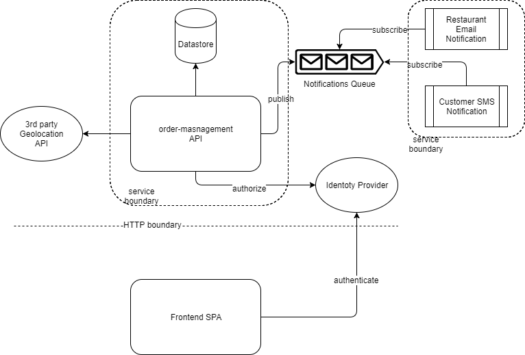

# High Level Architecture

The Order Management module is implemented as a REST-ful API on top of a relational database store.



## 3rd Party Geo-location Service
There is a requirement to calculate ETA of meal delivery based on customer and restaurant locations. Google API will be used to get the ETA with traffic delay estimation.

## Identity Provider
***Although there is no mention of this in the requirements, there are implications as to the need of some sort of user authentication and authorization. I will assume that an identity provider is in place, and therefore not include any implementation in the code submission***

This provider could be O-Auth based. And will be used not only for user authentication, but also API security to verify that a user is authorized to perform a specific API action (ex. rate, or create a restaurant)

## Messaging Queue
A RabbitMQ implementation used to queue the notifications to both restaurants and customers. We use the Publish/Subscribe model, since every message on the queue needs to be processed by all queue subscribers. The benefit of using a queue in this implementation is to offload the notification logic to another component to be processed asynchronously without overloading the API service and compromising its stability.

## Notification Services 
The Restaurant Email Notification and Customer SMS Notification services are subscribers of the messaging queue. In this code submission these two services will be mocked and their implementation will be a simple console logging of the messages processed off the queue.

## Order Management API
Is a REST-ful API written on top of NodeJS/ExpressJS in ```TypeScript```. Refer to API documentation [here](rest_api_design.md)

## Relational DataStore
Is a MySQL database used to store the relational schema of the domain model. Storing Restaurants, Meals, Ratings, Customers and Orders.