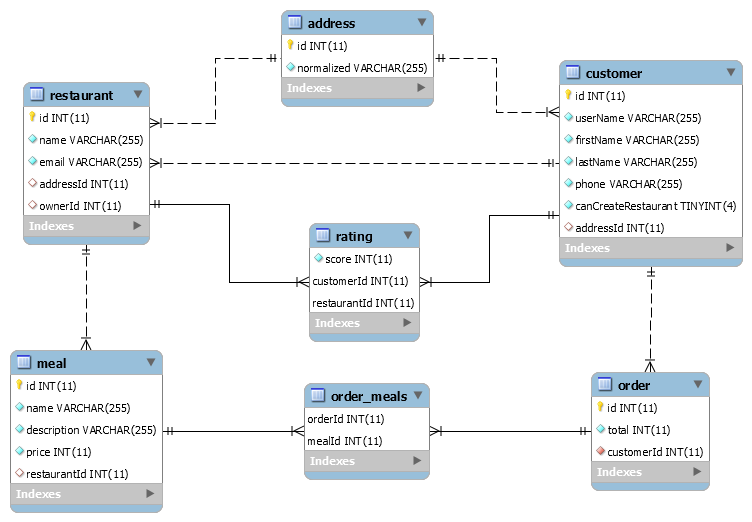

# Database Schema

## Notes and assumptions
* Rating, are modeled as many-to-many association between customer and restaurant so that we prevent a customer from rating the same restaurant more than once.

* Address, has an intentionally simplified free text field for address, done as such for the purposes of this exercise. Also, as the API will be using the geo-coding API, address normalization ensured before any address is created in the database.

* Since there is an open question in the requirements as to who can create a restaurant, I assumed that a customer can create a restaurant if given a permission, the permission is modeled for simplicity as a boolean flag in the customer table.

* data sizes, i.e. `VARCHAR(255)` and `INT(11)` are kept as their default types in the mysql database as they corresponded to `string` and `number` `JavaScript` types respectively.
