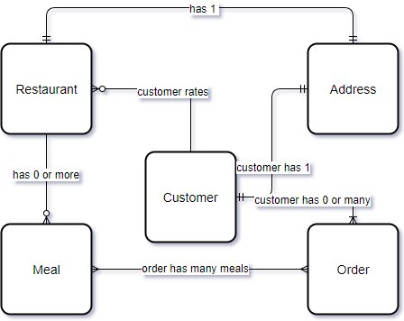

# Modeling

## Open Question
There are no clear requirements about use authentication/authorization. Therefore, based on the initial understanding of the requirements, it will be assumed that there is an identity provider that manages user logins.

***Items that are labeled as (out of scope) will not be included in the submitted solution, as there were no clear specifications or guidelines to propose a solution.***

## Personas
Identifying **Personas** or *User Types* is the first step to representing the requirements in the form of *User Journeys* so that they are defined just enough for the development process

I identified three Personas

### Anonymous User
can:
- Browse Restaurants and Meals
- Log in (out of scope)
- Sign up (out of scope)
### Account User (Customer)
can:
- Browse Restaurants and Meals
- Rate Restaurants
- Order Meals
- Receive SMS Notification of place order
### Restaurant Owner
There are no clear explanation as to who can create a restaurant, so the assumption was made that there is a special privilege or a process that can elevate a Customer to be a restaurant owner. Or an internal review process of newly created restaurants.
can:
- Browse Restaurants 
- Rate Restaurants **EXCEPT** theirs (cannot rate their own restaurants)
- Order Meals
- Create A Restaurant
- Add Meals to a restaurant they created

## Domain Overview
Based on the given requirements, the nouns of the business domain can for the following diagram:

**Address** is a key concept here because we need to include geo-location based calculation into the order. A uniform address format makes that easier.

### **Restaurant**
has:
- Address
- 0 or more Meals
- Rating
### **Customer**
has:
- Address
- 0 or more Orders
- 0 or more rates restaurants
### **Meal**
has:
- Price
- Description 
- Image
### **Order**
has:
- 1 or more Meals
- Total
- ETA (based on the geo-location of the customer and restaurant)
### **Address**
***for simplicity addresses are assumed to be local to Argentina, i.e. not international addresses allowed***

has:
- zip-code
- street name
- street number
- unit

